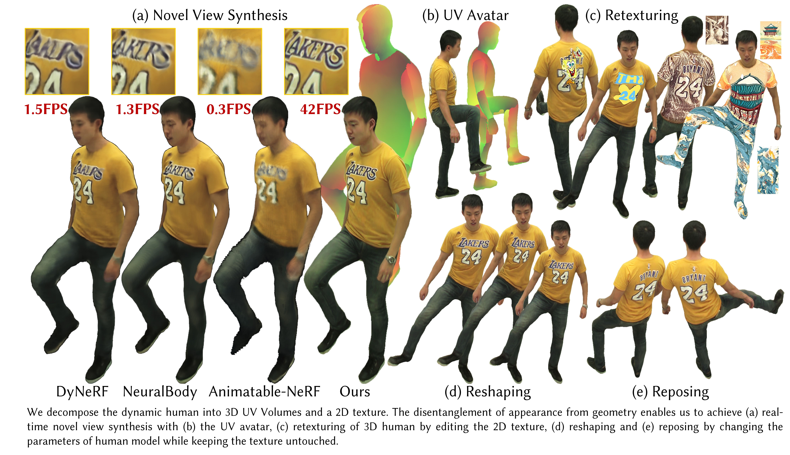

# UV Volumes for Real-time Rendering of Editable Free-view Human Performance<br><sub>Official PyTorch Implementation</sub>



**UV Volumes for Real-time Rendering of Editable Free-view Human Performance**<br>
Yue Chen, Xuan Wang, Xingyu Chen, Qi Zhang, Xiaoyu Li, Yu Guo, Jue Wang and Fei Wang
<br>
#### [Project Page](https://fanegg.github.io/UV-Volumes/)<br>

Abstract: *Neural volume rendering enables photo-realistic renderings of a human performer in free-view, a critical task in immersive VR/AR applications. But the practice is severely limited by high computational costs in the rendering process. To solve this problem, we propose the UV Volumes, a new approach that can render an editable free-view video of a human performer in realtime. It separates the high-frequency (i.e., non-smooth) human appearance from the 3D volume, and encodes them into 2D neural texture stacks (NTS). The smooth UV volumes allow much smaller and shallower neural networks to obtain densities and texture coordinates in 3D while capturing detailed appearance in 2D NTS. For editability, the mapping between the parameterized human model and the smooth texture coordinates allows us a better generalization on novel poses and shapes. Furthermore, the use of NTS enables interesting applications, e.g., retexturing. Extensive experiments on CMU Panoptic, ZJU Mocap, and H36M datasets show that our model can render 960 × 540 images in 30FPS on average with comparable photo-realism to state-of-the-art methods.*

## Citation

```
@article{chen2022uvvolumes,
  title={UV Volumes for Real-time Rendering of Editable Free-view Human Performance},
  author={Chen, Yue and Wang, Xuan and Zhang, Qi and Li, Xiaoyu and Chen, Xingyu and Guo, Yu and Wang, Jue and Wang, Fei},
  journal={arXiv preprint arXiv:2203.14402},
  year={2022}
}
```
